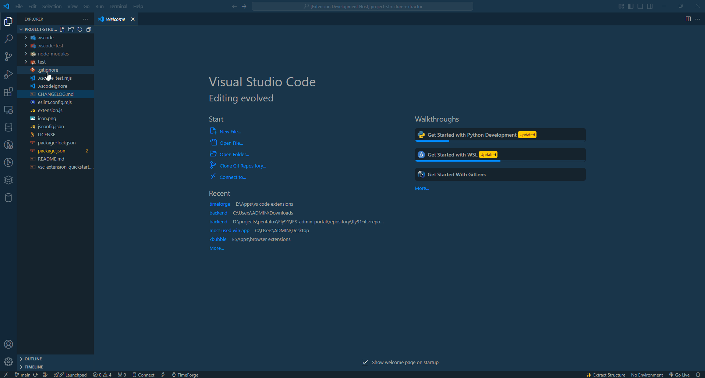
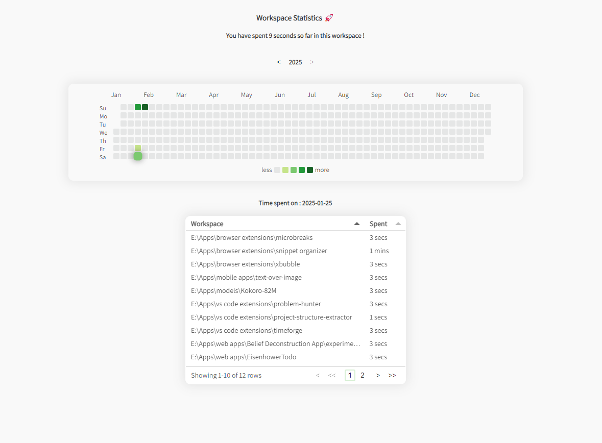
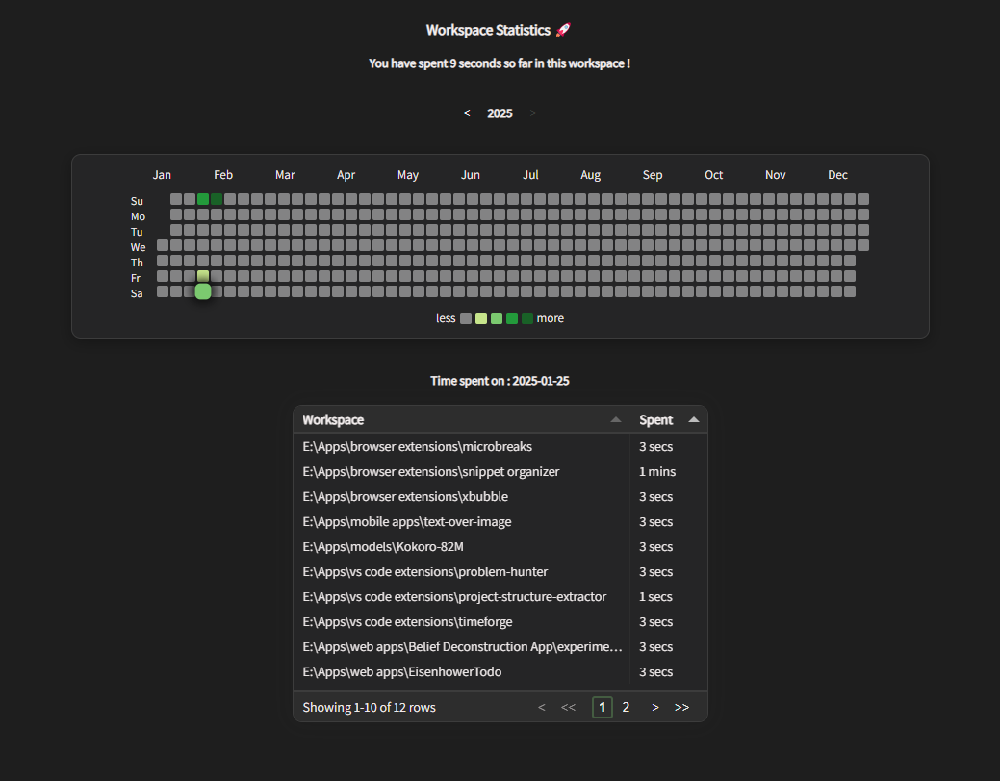

# TimeForge

A Minimalistic timer in the status bar that tracks your time spent on workspaces.

## Features

- ⏱ Set, Pause and Stop the timer with clicks
- 📂 Workspace-based time monitoring
- 📊 Github like heatmap to represent your time spent
- ⚡ Easy-to-use interface integrated with VS Code

## Installation

1. Open VS Code
2. Go to Extensions (Ctrl+Shift+X)
3. Search for "TimeForge"
4. Click Install

## Usage

Click for the timer to start ▶️ ; click to pause ⏸️ and double click to stop ⏹️

## Light 🔆 mode

## Dark 🌙 mode

## Commands

- `TimeForge: Start Tracking`: Manually start time tracking
- `TimeForge: Stop Tracking`: Pause time tracking
- `TimeForge: View Report`: Display time tracking statistics

## Requirements

- VS Code 1.60.0 or higher
- Node.js & npm

## Contributing

Contributions are welcome! Please feel free to submit a Pull Request.

## License

This extension is licensed under the [MIT License](LICENSE).